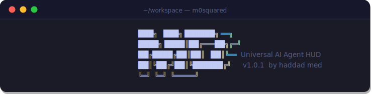
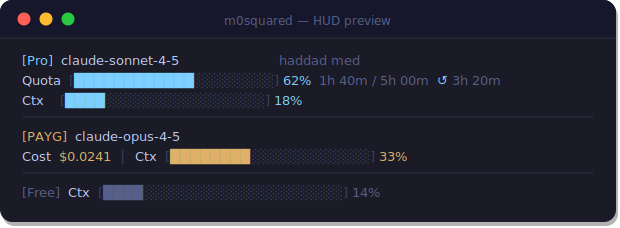

<div align="center">



### **M0²** — M-zero-Squared

*Real-time token usage indicator for AI coding agents*

---

[](https://www.npmjs.com/package/m0squared-indicator)
[](https://www.npmjs.com/package/m0squared-indicator)
[](#license)
[](https://github.com/m0squared/m0s-indicator)
[](https://claude.ai/code)

</div>

---

## What is M0²?

**M0²** is a live HUD that sits inside your AI coding agent and shows you exactly how much of your token quota you've consumed — in real time, right where you work.

No more getting cut off mid-task. No more opening dashboards. No more guessing.

> *Start full. Watch it drain. Know when to stop.*

<div align="center">

</div>

---

## Supported Agents

| Agent | Status | Integration |
|---|---|---|
| **Claude Code** | ✅ Full support | Native `statusLine` hook — live in the status bar |
| **Codex CLI** | ✅ Supported | `PostToolUse` hook — tracks every response |
| **Gemini CLI** | ✅ Supported | `AfterTool` hook — tracks every response |

> More agents coming. PRs welcome.

---

## Install

Pick your method — they all do the same thing.

### npx *(recommended — no install needed)*
```bash
npx m0squared-indicator install
```

### npm
```bash
npm install -g m0squared-indicator
m0squared-indicator install
```

### pip
```bash
pip install m0squared-indicator
m0squared-indicator install
```

### curl *(Linux / macOS)*
```bash
curl -sSL https://raw.githubusercontent.com/m0squared/m0s-indicator/main/scripts/install.sh | bash
```

### PowerShell *(Windows)*
```powershell
irm https://raw.githubusercontent.com/m0squared/m0s-indicator/main/scripts/install.ps1 | iex
```

---

## How it works

M0² auto-detects which AI agents are installed on your machine and patches their config files silently. After a restart, the HUD appears automatically.

```
  M0²  v1.0.0  Universal AI Agent HUD
  by morius

  Scanning for AI agents…

  ✓  Claude Code     detected
  ✓  Codex CLI       detected
  ✗  Gemini CLI      not found

  Installing for: Claude Code, Codex CLI

  ✓ M0² installed successfully!
  Restart your agent to see the HUD.
```

---

## Usage

```bash
m0squared-indicator install          # install for all detected agents
m0squared-indicator install --agent claude-code   # target one agent
m0squared-indicator uninstall        # remove from all agents
m0squared-indicator update           # update to latest version
m0squared-indicator agents           # list detected agents and status
```

---

## Configuration

After install, a config file is created at `~/.m0squared/config.json`:

```json
{
  "plan": "auto",
  "bar_width": 20,
  "codex": {
    "session_token_limit": 100000
  },
  "gemini": {
    "session_token_limit": 100000
  }
}
```

| Key | Values | Description |
|---|---|---|
| `plan` | `auto` `pro` `max` `payg` `free` | Override plan auto-detection |
| `bar_width` | number | Width of the progress bar (default: 20) |
| `*.session_token_limit` | number | Token limit for Codex / Gemini sessions |

> **Auto-detection:** Claude Code Pro/Max is detected automatically via the `rate_limits` field. Set `"plan": "max"` manually if you're on Max.

---

## Uninstall

```bash
npx m0squared-indicator uninstall
```

This removes all hooks from your agent configs and deletes `~/.m0squared/`.

---

## Why M0²?

Built out of pure love for [Claude Code](https://claude.ai/code) — and frustration with hitting token limits mid-session without any warning.

M0² was born from a simple idea: *your tools should tell you when you're running out of fuel.*

> **Built by a Claude Code lover, with Claude Code.**  
> *— haddad med / morius*

---

## License

© 2026 morius (M-zero-Squared / haddad med). All rights reserved.

Free for personal use. No redistribution or commercial use without written permission.  
See [LICENSE](./LICENSE) for full terms.

---

<div align="center">

Made with ❤️ by **haddad med** · [github.com/m0squared](https://github.com/m0squared)

*If M0² saved your session — give it a ⭐*

</div>
